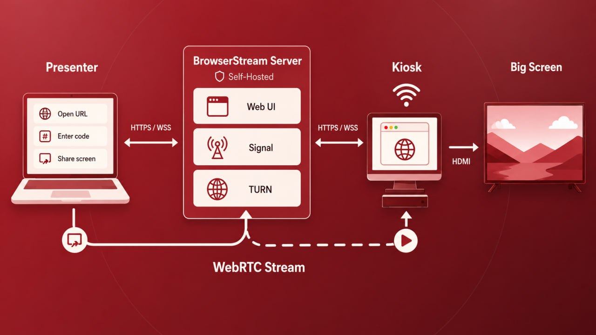

# BrowserStream

BrowserStream is a self-hosted WebRTC screen-sharing service for meeting-room
displays. It is derived from
[Laplace](https://github.com/adamyordan/laplace).



## Install

### Requirements

- Linux with Docker Engine and Docker Compose v2
- Python 3
- `iproute2` (`ip` command)

### 1. Clone

```sh
git clone https://github.com/CLSMCSMII/browserstream.git
cd browserstream
```

### 2. Configure and deploy

```sh
./install.sh
```

The installer detects the LAN IP and asks:

```text
Application name [AwareStream]:
Public URL / allowed origin [https://browserstream.example.com]:
Room ID [awmeeting]:
Room label [Aware Building]:
Install bundled coturn? [Y/n]:
TURN realm [hostname from Public URL]:
TURN URL [turn:<detected-IP>:3478]:
coturn listening IP [<detected-IP>]:
coturn relay IP [<detected-IP>]:
```

Press **Enter** to accept a displayed default. `allowed_origins` is derived from
the Public URL, random room/TURN secrets are generated, and the selected
containers are deployed. The normal install/update path never overwrites an
existing `config.json`; `--add-room` is the explicit atomic modification path.

## Update an existing installation

Use the same Linux account or privilege level that performed the original
installation:

```sh
cd /path/to/browserstream
cp -p config.json "config.json.backup-$(date +%Y%m%d-%H%M%S)"
git status --short
git pull --ff-only origin main
```

If the installation uses bundled coturn, update both services:

```sh
./install.sh --with-turn
```

If coturn is external or not used, update BrowserStream only:

```sh
./install.sh
```

The installer reuses the existing `config.json` without prompting and preserves
rooms, display tokens, URLs, TURN secrets, and other settings. Do not run
`git reset --hard` when `git status --short` shows local source changes. Verify
the deployment after updating:

```sh
docker compose ps
docker compose logs --tail=100 browserstream
curl -fsS http://127.0.0.1:18080/healthz
```

Replace `127.0.0.1` with the configured bind address when BrowserStream listens
on a LAN IP.

### 3. Add HTTPS reverse proxy

Screen capture requires HTTPS. Example Nginx location:

```nginx
server {
    listen 80;
    server_name browserstream.example.com;
    return 308 https://$host$request_uri;
}

server {
    listen 443 ssl http2;
    server_name browserstream.example.com;

    ssl_certificate /etc/ssl/certs/cert.pem;
    ssl_certificate_key /etc/ssl/private/cert.key;

    location / {
        proxy_pass http://LAN-IP:18080;
        proxy_http_version 1.1;
        proxy_set_header Upgrade $http_upgrade;
        proxy_set_header Connection "upgrade";
        proxy_set_header Host $host;
        proxy_set_header X-Real-IP $remote_addr;
        proxy_set_header X-Forwarded-For $proxy_add_x_forwarded_for;
        proxy_set_header X-Forwarded-Proto $scheme;
        proxy_read_timeout 3600s;
        proxy_send_timeout 3600s;
    }
}

```

Replace `LAN-IP` with the detected server address. Allow TCP `18080` only from
the reverse proxy. TURN uses TCP/UDP `3478` and UDP `49160-49200`.

## Use

1. Enroll the room display once at
   `https://YOUR-DOMAIN/room/ROOM_ID#token=DISPLAY_TOKEN`.
2. The display stores the token locally and shows a six-character code.
3. On a desktop computer, open `https://YOUR-DOMAIN`.
4. Select the room, enter its code, choose whether to share audio, and choose a screen or window.
5. When sharing audio, enable tab or system audio in the browser capture dialog. The presenter can mute it or adjust the transmitted volume while sharing.

Audio capture availability depends on the presenter browser, operating system, and selected capture source. Browser tabs are the most consistently supported source. If the display browser blocks audible autoplay, BrowserStream shows an **Enable audio** button; managed kiosks can instead allow autoplay through their browser policy.

## Generate a kiosk URL

Generate a copy/paste-ready display-enrollment URL from the existing
configuration:

```sh
# Select interactively when more than one room exists
./kiosk.sh

# Select a room directly; stdout contains only the URL
./kiosk.sh training

# Print labeled URLs for every room
./kiosk.sh --all
```

For a non-default configuration path:

```sh
BROWSERSTREAM_CONFIG=/path/to/config.json ./kiosk.sh training
```

Prompts and room choices are written to stderr, so a single URL can be captured
without extra text:

```sh
KIOSK_URL=$(./kiosk.sh training)
printf '%s\n' "$KIOSK_URL"
```

A kiosk URL contains the room's secret display token. Treat it like a password:
do not commit it, post it in public chat, or store it in shared logs.

## Useful commands

```sh
# Add one or more rooms to an existing installation and redeploy BrowserStream
./install.sh --add-room

# Validate configuration
docker compose run --rm --no-deps browserstream -validate-config

# Stop and remove bundled coturn
./install.sh --stop-turn
```

`--add-room` preserves existing rooms and settings, generates a unique display
token for each new room, and creates a mode-`0600` timestamped configuration
backup before the atomic update. It prints each new display enrollment URL. Up
to 100 rooms are supported. Use `--add-room --init-only` to update the
configuration without redeploying.

Use the listening and relay IP prompts to select an address on a multi-homed
server. Use `./install.sh --init-only` to create configuration without deploying.

If TURN is behind NAT, set `coturn.external_ip` in `config.json`. Never commit
`config.json`, `coturn/turnserver.conf`, certificates, or private keys.

## Development

Requires Go 1.26:

```sh
go test -race ./...
go vet ./...
go build -o browserstream .
```

See [SECURITY.md](SECURITY.md), [CONTRIBUTING.md](CONTRIBUTING.md), and
[coturn/README.md](coturn/README.md). Licensed under [MIT](LICENSE).
